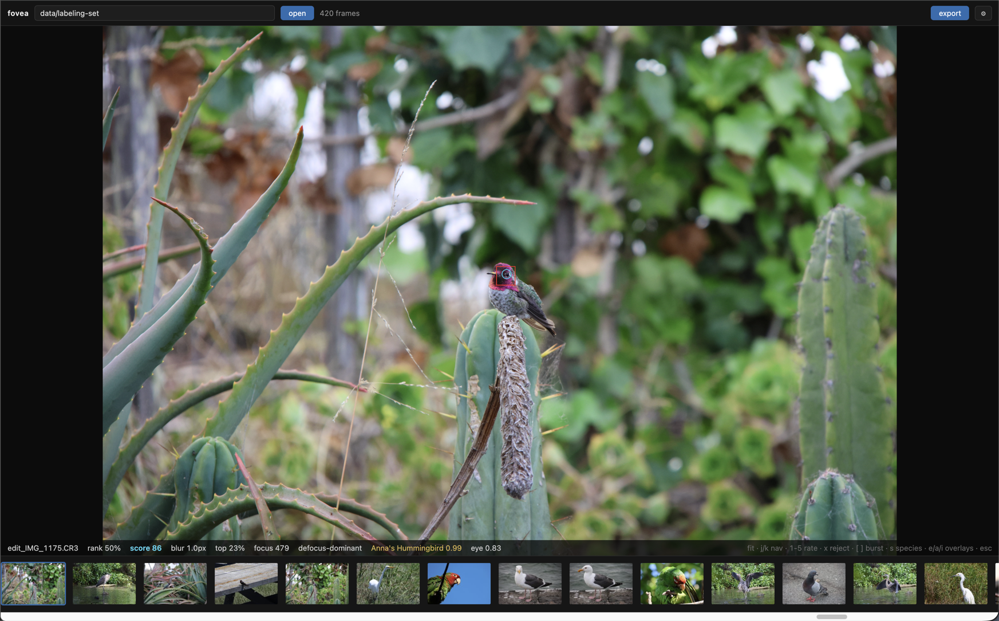
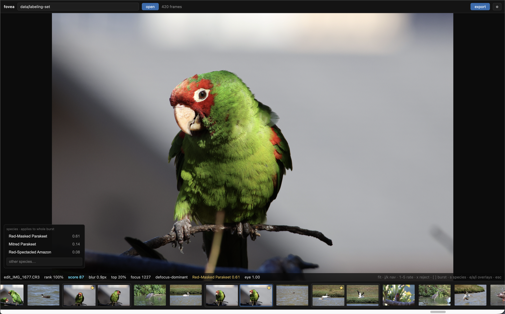
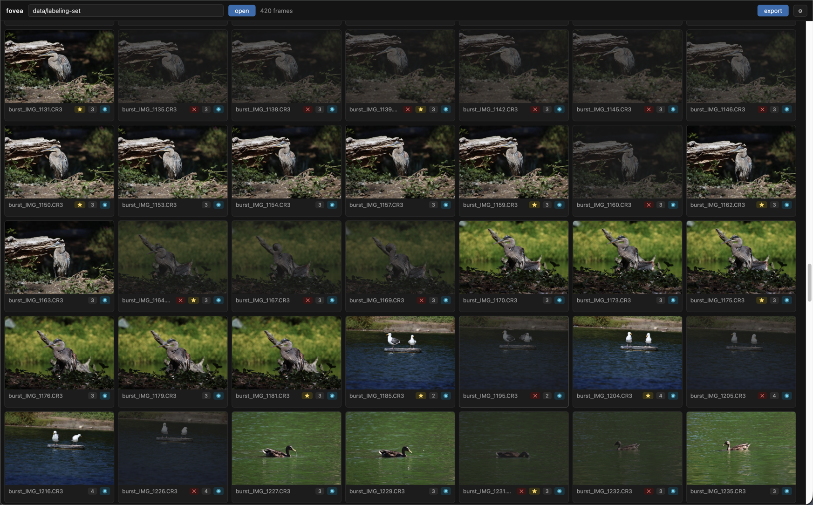
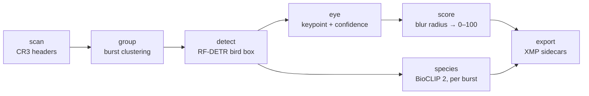

# Fovea

> the point of sharpest vision.

Local first macOS app that culls bird photos. Point it at a folder of Canon CR3s: it finds each bird's eye, scores critical focus 0–100, overlays where the camera's AF actually landed, identifies the species, and writes XMP sidecars so Lightroom opens with only the keepers rated.

<!-- TODO: swap for images/README/demo.gif once recorded -->


A morning of shooting at 15–30 fps comes home as a few thousand raw files, and maybe a hundred of them are worth keeping. Finding those means zooming to 100% on the eye of every single frame, because if the eye is soft, nothing else about the shot matters. Fovea does that pass for you.

## What it does

- **Eye detection**: an RF-DETR bird detector finds the bird, then a keypoint model trained from scratch on hand-labeled shots pins the eye.
- **Focus score**: a small ordinal CNN estimates the physical blur radius at the eye in pixels, then maps it to 0–100 with a percentile that tells you how the shot ranks against your own library.
- **Autofocus overlay**: decodes Canon's AF metadata and draws the in-focus points over the frame, so you can see what the camera thought it locked onto.
- **Species ID**: BioCLIP 2 identifies the bird zero-shot from 11k species, once per burst, with top-3 confidences and an optional continent filter.
- **Lightroom handoff**: ratings, reject flags, and hierarchical species keywords land in XMP sidecars that Lightroom reads on import, with every measurement kept under a `fovea:` namespace.
- **Speed**: reads the JPEG embedded in each CR3 by byte range instead of demosaicing raw, decodes at reduced DCT scale, and caches everything, so a folder you've seen before opens instantly.

| Species | Grid |
| ------- | ---- |
|  |  |

## How it works



Each stage is independently toggleable, caches its results per folder, and attaches to the same entry stream. The core is a pure-Python library with a CLI. The FastAPI layer and the React UI (pywebview shell) are just clients.

```
src/fovea/core/   pipeline: ingest → metadata → group → detect → score → species → export
src/fovea/api/    FastAPI + SSE progress, pydantic schemas → generated TS types
src/fovea/app/    pywebview shell (uvicorn in-thread + native window)
ui/               React + TypeScript + Vite
tools/            labeling, training, ONNX export
```

## Install

```sh
brew install exiftool
git clone https://github.com/JamesZhang22/fovea && cd fovea
uv sync
```

Requires macOS and [uv](https://docs.astral.sh/uv/) (Python 3.14).

## Usage

```sh
# App
uv run fovea app

# CLI
uv run fovea cull <folder> --eye --species   # the full pass: score, rank, ID, sidecars
uv run fovea scan <folder>                   # metadata + AF geometry as JSON
uv run fovea contactsheet <folder>           # HTML grid with AF overlays
```

Recommended flow: photos → Fovea → import into Lightroom.

## Development

```sh
make dev      # FastAPI (:7343) + Vite (:5173)
make check    # ruff + tsc + oxlint + pytest
make app      # PyInstaller → dist/fovea.app
```

## Licensing

MIT. Detection uses [RF-DETR](https://github.com/roboflow/rf-detr) (Apache-2.0), species ID uses [BioCLIP 2](https://imageomics.github.io/bioclip-2/) (MIT) with region data from the [IOC World Bird List](https://www.worldbirdnames.org/) (CC-BY 4.0). The eye and focus models are trained only on this project's own labeled photos.
