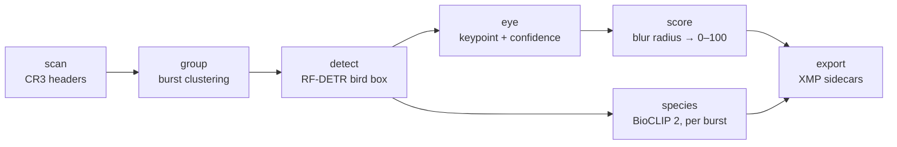

# Fovea

> the point of sharpest vision.

Local first macOS app that culls bird photos. Point it at a folder of Canon CR3s: it finds each bird's eye, scores critical focus 0–100, overlays where the camera's AF actually landed, identifies the species, and writes XMP sidecars so Lightroom opens with only the keepers rated.

<!-- TODO: swap for images/README/demo.gif once recorded -->


A morning of shooting at 15–30 fps comes home as a few thousand raw files, and maybe a hundred of them are worth keeping. Finding those means zooming to 100% on the eye of every single frame, because if the eye is soft, nothing else about the shot matters. Fovea does that pass for you.

## What it does

- **Finds the eye**: a bird detector (RF-DETR) plus an eye keypoint model trained from scratch on hand-labeled photos from real shoots.
- **Scores focus**: an ordinal CNN estimates physical blur radius (px) at the eye, mapped through a fixed radius -> score curve and a running percentile calibration.
- **Display camera autofocus**: Canon AFInfo2 decoded to in-focus AF boxes overlaid.
- **Knows what you shot**: BioCLIP 2 zero-shot species ID over 11k bird species, one inference per burst, top-3 with confidences and optional continent filter.
- **Lightroom**: ratings, reject flags, hierarchical keywords, and all measurements under a `fovea:` XMP namespace
- **Fast**: embedded JPEG extraction by byte range (never demosaic), DCT-scaled decode, SQLite cache keyed on file+model versions.

| Species confirm | Burst grid |
| --------------- | ---------- |
|  |  |

## How it works



Each stage is independently toggleable, caches its results per folder, and attaches to the same entry stream. The core is a pure-Python library with a CLI. The FastAPI layer and the React UI (pywebview shell) are just clients.

```
src/fovea/core/   pipeline: ingest → metadata → group → detect → score → species → export
src/fovea/api/    FastAPI + SSE progress, pydantic schemas → generated TS types
src/fovea/app/    pywebview shell (uvicorn in-thread + native window)
ui/               React + TypeScript + Vite
tools/            labeling, training, ONNX export
```

## Install

```sh
brew install exiftool
git clone https://github.com/JamesZhang22/fovea && cd fovea
uv sync
```

Requires macOS and [uv](https://docs.astral.sh/uv/) (Python 3.14).

## Usage

```sh
# App
uv run fovea app

# CLI
uv run fovea cull <folder> --eye --species   # the full pass: score, rank, ID, sidecars
uv run fovea scan <folder>                   # metadata + AF geometry as JSON
uv run fovea contactsheet <folder>           # HTML grid with AF overlays
```

Recommended flow: photos → Fovea → import into Lightroom.

## Development

```sh
make dev      # FastAPI (:7343) + Vite (:5173)
make check    # ruff + tsc + oxlint + pytest
make app      # PyInstaller → dist/fovea.app
```
