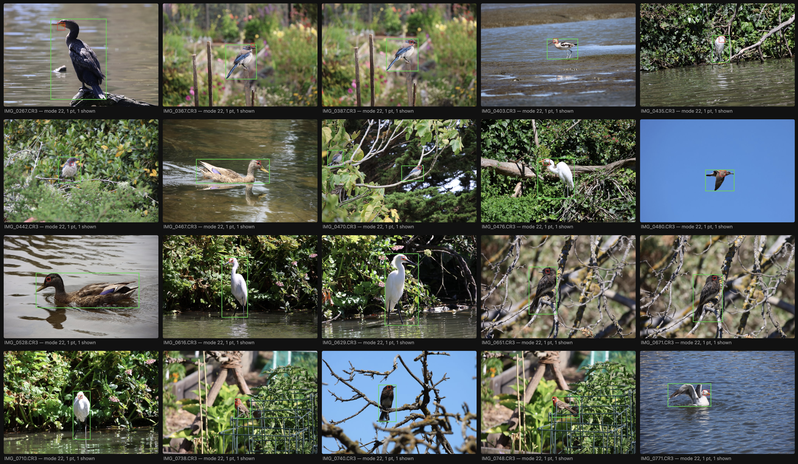

# Fovea (WIP)

Local first macOS app that culls bird photos. Point it at a folder of Canon CR3 files it finds each bird's eye, scores critical focus 0–100, shows where the camera's AF actually landed and writes XMP sidecars so Lightroom Classic opens with only the keepers rated.

## Usage

```sh
fovea cull <folder>          # group bursts, score focus, rank, write XMP sidecars
fovea scan <folder>          # metadata + AF geometry as a JSON manifest
fovea contactsheet <folder>  # HTML grid with AF point overlays
```

`fovea cull` rates the best frames of each burst (4 = burst best, 3 = top of burst) and
records its measurements under a `fovea:` XMP namespace. Existing sidecars are never
overwritten. Every pipeline stage can be toggled off (`--no-group`, `--no-score`,
`--no-export`).

## Samples

### Bird and AF detection


## Requirements

- macOS, Python 3.14+, [uv](https://docs.astral.sh/uv/)
- `brew install exiftool`
